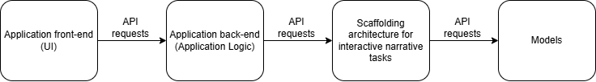

# NL QuesTale

> An application for Interactive and Immersive Storytelling with LLMs

This project was developed as part of a thesis work at Politecnico di Milano, Computer Science Engigneering, Academic Year 2025/2026.

---

## Table of Contents

- [Overview](#overview)
- [Architecture](#architecture)
- [Prerequisites](#prerequisites)
- [Installation](#installation)
  - [1. Download the Source Code](#1-download-the-source-code)
  - [2. Set Up LM Studio](#2-set-up-lm-studio)
  - [3. Set Up the Python Virtual Environment](#3-set-up-the-python-virtual-environment)
- [Running the Application](#running-the-application)
  - [1. Start LM Studio](#1-start-lm-studio)
  - [2. Start the Retrieval API](#2-start-the-retrieval-api)
  - [3. Start the Back-end](#3-start-the-back-end)
  - [4. Start the Front-end](#4-start-the-front-end)
- [Authors](#authors)
- [Supervisor](#supervisor)
- [License](#license)

---

## Overview

This repository cotains the code and the data to run the application in local. QuesTale is an interactove application that laverage the generative power of LLMs, combined with a scaffolding architecture, to offer interactive and immersive narrative experiences, specifically set in a fantasy setting.

---

## Architecture

The high-level architecture of the whole solution is composed of four main components,
which communicate through API calls. In the following list we will describe them briefly:

1. Models. This is the layer that hosts and manages the models used by the solution. We used LM
studio for this component of the solution. LM studio is a desktop application that allows to run locally
AI models, especially LLMs. Other than offering many useful tools to download, manage and supervise
models, the key feature that makes LM studio suitable for our solution is that it allows API calls to the
models. This makes it possible to easily load and use models in a completely automatic way.

2. Scaffolding architecture. This is the architecture at the core of this work. Its role is to invoke various
models from the Models component (among which the story generation model) and produce data useful
for the functioning of the interactive application. It mediates between the application and the LLMs.
The functionalities that this component offers are Retrieval Augmented Generation (RAG), information
extraction from the user input, information extraction from the output text, and finally generation of the
story scenes.

3. Application back-end. This component constitutes the real application and its logic. It invokes
the functions of the scaffolding architecture through API calls, and uses the data received to perform
operations such as updating the application state, invoking other operations from the architecture or
outputting the data to the front-end.

4. Application front-end. This component constitutes the UI. The user will interact with this compo
nent and the various interactions will cause invocations to the application back-end.



---

## Prerequisites

Before proceeding, ensure the following software is installed on your system:

- [Git](https://git-scm.com/)
- [Python 3.10+](https://www.python.org/downloads/)
- [Node.js 18+ and npm](https://nodejs.org/)
- [LM Studio](https://lmstudio.ai/download)
- [JetBrains Rider](https://www.jetbrains.com/rider/) *(required only to run the back-end via IDE; see Section 3.1)*
- [.NET SDK [version]](https://dotnet.microsoft.com/download) *(required to run the back-end from the terminal; see Section 3.2)*

---

## Installation

### 1. Download the Source Code

Clone the repository using Git:

```bash
# HTTPS
git clone https://gitlab.com/i3lab/tesinicologiallongo.git

# SSH
git clone git@gitlab.com:i3lab/tesinicologiallongo.git
```

Then navigate into the project directory:

```bash
cd Code
```

### 2. Set Up LM Studio

1. Download and install LM Studio from: https://lmstudio.ai/download

2. Open LM Studio.

3. Navigate to the **Model Search** panel (`Ctrl + Shift + M`).

4. Download the following models:
   - **LLM:** `llama-3.1-8b-instruct` by *unsloth*, quantization `Q5_K_XL`
   - **Embedding:** `text-embedding-gemma-300m` by *unsloth*, quantization `Q8_0`

### 3. Set Up the Python Virtual Environment

1. Open a terminal and navigate to the retrieval API folder:

   ```bash
   cd Code/retrieval_api
   ```

2. Create the virtual environment:

   ```bash
   python -m venv venv
   ```

3. Activate the virtual environment:

   **Windows (PowerShell):**
   ```powershell
   .\venv\Scripts\Activate.ps1
   ```
   > If PowerShell blocks script execution, run the following command once and then retry:
   > ```powershell
   > Set-ExecutionPolicy -Scope CurrentUser RemoteSigned
   > ```

   **macOS / Linux:**
   ```bash
   source venv/bin/activate
   ```

4. Upgrade pip and install the required dependencies:

   ```bash
   python -m pip install --upgrade pip
   python -m pip install -r requirements.txt
   ```

   > Warning: the current `requirements.txt` is a snapshot of the working environment already present in this repository. It reflects the packages currently installed in the local `venv`, but it may not be a conflict-free, fresh-install setup for every machine.
   > If you want to reproduce the exact environment used here, prefer the existing local `venv` folder in the project.

   Once the environment is active, you will see `(venv)` prepended to your terminal prompt. To deactivate it at any time, run:

   ```bash
   deactivate
   ```

---

## Running the Application

All four components must be started in the order listed below.

### 1. Start LM Studio

1. Open LM Studio.
2. Navigate to the **Developer** panel (`Ctrl + 2`).
3. On the Server Setting, set the Server Port to 1234
3. Start the local inference server by clicking the **Start Server** button, or using the shortcut `Ctrl + R`.

### 2. Start the Architecture

1. Open a terminal and navigate to the retrieval API folder:

   ```bash
   cd Code/retrieval_api
   ```

2. Activate the virtual environment (see [Installation → Step 3](#3-set-up-the-python-virtual-environment) if not already done).

3. Start the server:

   ```bash
   python run.py
   ```

### 3. Start the Back-end

#### Option A — From JetBrains Rider

1. Open the folder `Code/backend_api/ThesisBackendAPI` in JetBrains Rider.
2. Run the entry point: `Code/backend_api/ThesisBackendAPI/ThesisBackendAPI/Program.cs`

#### Option B — From the Terminal

1. Navigate to the back-end project folder:

   ```bash
   cd Code/backend_api/ThesisBackendAPI/ThesisBackendAPI
   ```

2. Build and run the application:

   ```bash
   dotnet run
   ```

   > Ensure the [.NET SDK [version]](https://dotnet.microsoft.com/download) is installed before proceeding.

### 4. Start the Front-end

1. Open a terminal and navigate to the front-end folder:

   ```bash
   cd Code/frontend/my-app
   ```

2. Start the development server:

   ```bash
   npm run dev
   ```

3. Open the URL printed in the terminal (typically `http://localhost:3000`) in your browser of choice.

---

## Authors

- **Nicolò Giallongo**  — nicolo.giallongo@mail.polimi.it

## Supervisor

- **Prof. Franca Grazotto**
- **Giulia Valcamonica**
- **Francesco Piferi**
- **Francesco Vona**

